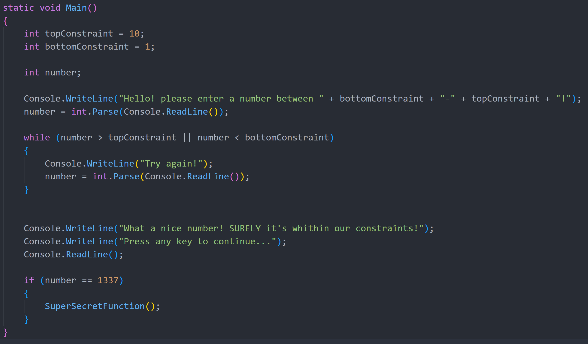

# Escaping The Matrix

## Goal
Here we have [program.exe](program.exe) which is a compiled .NET (C#) executable.

We got lucky and have a screenshot of the program's main:

Our goal is to execute the `SuperSecretFunction` function

## Instructions and Useful stuff
- Good luck

__Happy Hacking__